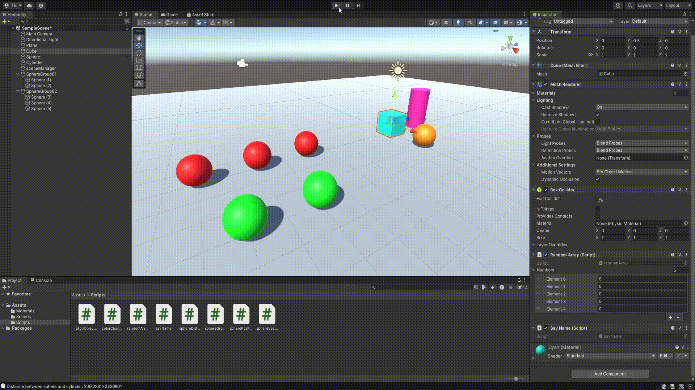
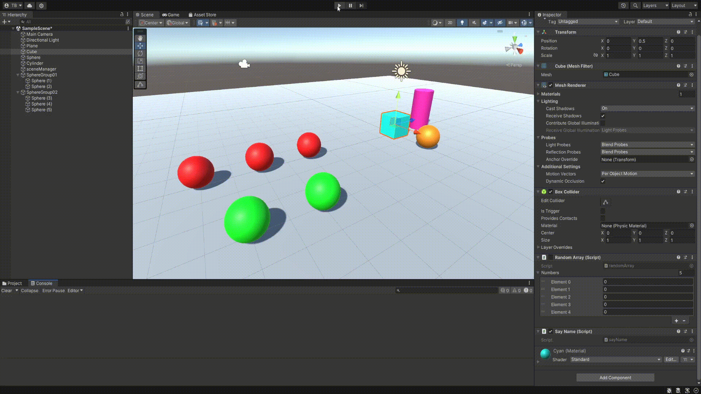
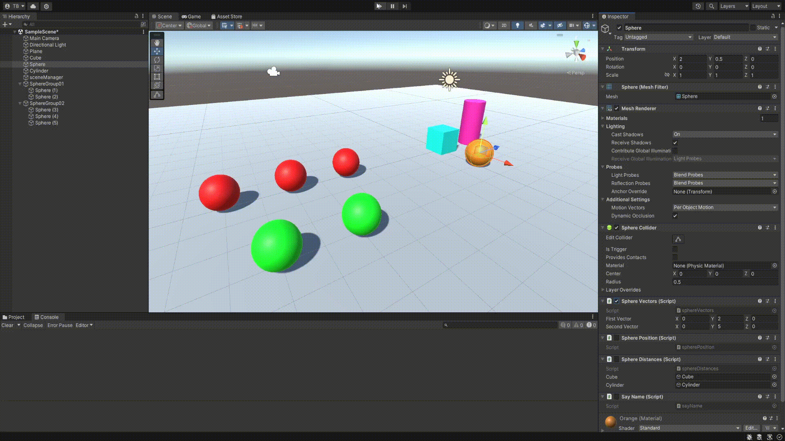
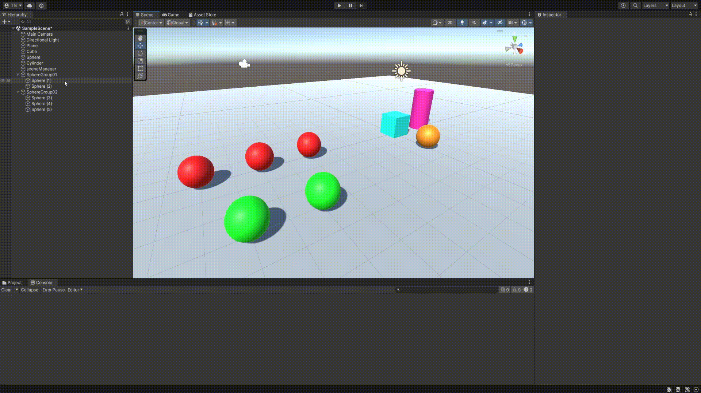

# II_ThomasBradley_Pr02  

## 01. Array Aleatorio 
  

## 02. Escena + Nombre en Consola  

## 03. Dos Vector3   

## 04. Posición de la Esfera  

## 05. Distancia a la Esfera  

## 06. Alinear con la Esfera   

## 07. Cambio de Color   

## 08. Grupos de Esferas   
